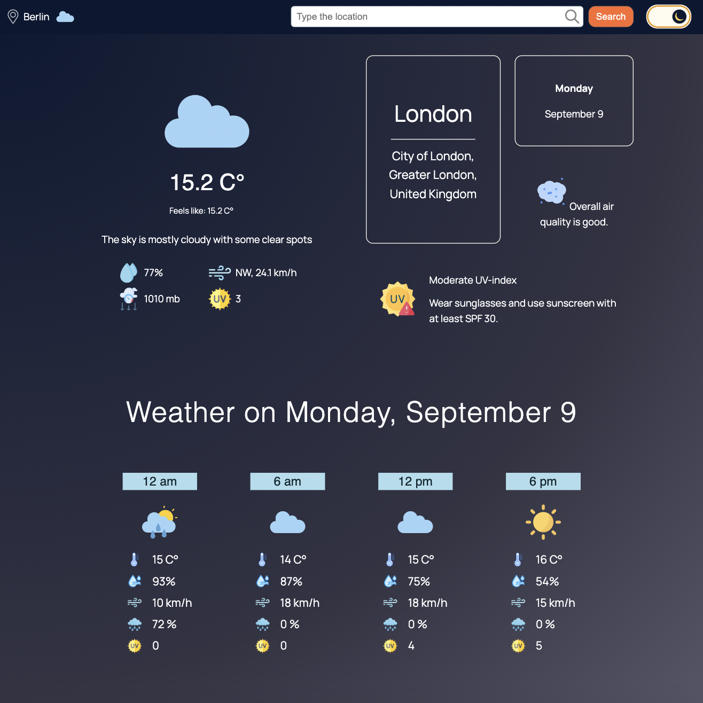

# Weather Web App

 

## Features:

* Current weather;
* Weather forecast for 3 days;
* Hourly weather forecast;
* Air Quality monitor;
* UV-alerts;
* Sun & Moon information.

## Technologies used:

**Frontend:** React, Next.js, CSS, Redux Toolkit, geoCoding

**API:** WeatherAPI, Google Maps API

## Getting Started

First, run the development server:

```bash
npm run dev
# or
yarn dev
# or
pnpm dev
# or
bun dev
```

Open [http://localhost:3000](http://localhost:3000) with your browser to see the result.


